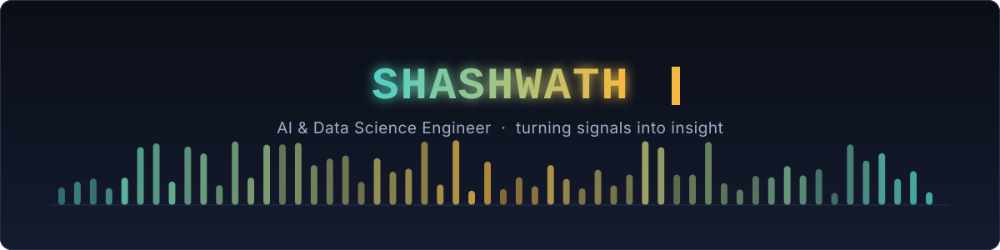

 

 

## 👋 About Me

- 🎓 AI & Data Science undergraduate at **NMAM Institute of Technology** — currently in my 6th semester
- 💼 Completed a **Technology Consulting** internship at **Wipfli India LLP**, Bengaluru Delivery Center
- ✍️ Lead author of a published **IEEE Access** journal paper — see below
- 🧠 I like building the unglamorous middle layer: OCR pipelines, watermark decoders, streaming data layers — the parts that turn raw signal into something usable
- 🔭 Currently building **PromptCraft** and a **Three.js-powered portfolio** (more in [Currently Building](#-currently-building))
- 📫 Reach me on [LinkedIn](https://www.linkedin.com/in/shashwathp/)

 

## 📄 Publication

**AURA-Net: Authorship Unification and Robustness Architecture**
A U-Net-based, dual-head (bit + presence) deep learning system for robust image watermarking that stays verifiable after **physical print-and-capture** — not just digital re-saves. Evaluated against 8 real-world attacks (JPEG compression, Gaussian blur, rescaling, low light, salt-and-pepper noise, cropping, median filtering, and print-and-capture itself).

- Personal contribution: the **decoding pipeline** — a retry-decode mechanism with Hamming-distance-based correction, presence detection, and the full robustness evaluation
- Achieved **19.84 dB PSNR**, **0.997 SSIM**, and ~0.003s inference time, with 40–44% bit accuracy retained under four combined attacks
- Originally built and presented as part of an internship selection process for a Japanese research institution

 

## 🛠️ Tech Stack

  

 

## 🚀 Featured Projects

### 🎙️ VoiceDoc — Document-to-Speech Web App

Upload a photo of a printed page → OCR pulls the text out → the app reads it back to you as an MP3. Full-stack app with a Flask backend and a React/Vite frontend, built for both plain text and math-equation documents.

- OCR via **Tesseract + pytesseract**, with **OpenCV** image preprocessing ahead of it
- Text-to-speech via **gTTS**, served through a custom audio player (seek, speed, volume, MP3/TXT download)
- Full auth (salted SHA-256), SQLite-backed conversion history, light/dark mode
- Containerized with **Docker**, deployable on **Railway**; this live demo is hosted on **Vercel**
- Started life as a Flask-only MVP ([`TTS-proj`](https://github.com/Shashwath007/TTS-proj)) before being rebuilt into the full React app above

  

### 📊 Superstore Data Warehouse — Medallion Architecture on Databricks

An end-to-end data warehouse built during a data engineering internship: **Bronze → Silver → Gold** on Databricks, feeding a 7-page Power BI dashboard — extended with a real-time streaming pipeline and an ML forecasting layer.

- **Batch:** 9,994-row Kaggle Superstore dataset cleaned into a star schema (1 fact + 4 dimension tables, 10K+ fact rows) using PySpark + Delta Lake
- **Streaming:** a fake order generator every 5s → Silver cleaning → Gold aggregation every 20s → a live Power BI page over DirectQuery
- **ML:** Spark MLlib Linear Regression forecasting sales, profit, and orders 3 months out (R² up to 0.69 overall)
- **Validated:** a dedicated data-quality test suite (5/5 checks passing) catching null keys, bad dates, and negative sales before they hit Silver

  
  
  
  

<b>📌 At a glance (live, auto-updating)</b>

 

<table>
<tr>
<td></td>
<td></td>
</tr>
</table>

 

## 🔭 Currently Building

- **PromptCraft** — a single-file prompt-engineering tool with 9 LLM providers (Anthropic, OpenAI, Gemini, Groq, Mistral, DeepSeek, and more), turning rough context into a polished, structured prompt through guided clarifying questions
- **Developer Portfolio** — a single-page site with a Three.js particle background, GSAP ScrollTrigger animations, and a dual-ring magnetic cursor
- **CALFV** — comparing TCN/Transformer architectures against LightGBM and SVR for electrochemistry sensor data (carbon + iron vanadate composite electrodes), with SHAP interpretability

 

## 📊 GitHub Overview

<table>
<tr>
<td></td>
<td></td>
</tr>
</table>

⚙️ These three are self-generated by <code>readme-stats.yml</code> using a personal token, so they include private repo/contribution data — not the public Vercel endpoint, which can only see what's public.

 

## 🐍 Contribution Snake

<picture>
  <source media="(prefers-color-scheme: dark)" srcset="https://raw.githubusercontent.com/Shashwath007/Shashwath007/output/github-contribution-grid-snake-dark.svg" />
  <source media="(prefers-color-scheme: light)" srcset="https://raw.githubusercontent.com/Shashwath007/Shashwath007/output/github-contribution-grid-snake.svg" />
  
</picture>

⚙️ Powered by the <code>snake.yml</code> workflow below — see setup notes. The same workflow also outputs a <a href="https://raw.githubusercontent.com/Shashwath007/Shashwath007/output/github-contribution-grid-snake.gif">GIF version</a> for places that don't render animated SVGs (LinkedIn, resume, portfolio).

 
 

### 📫 Let's connect

Thanks for stopping by ⭐

